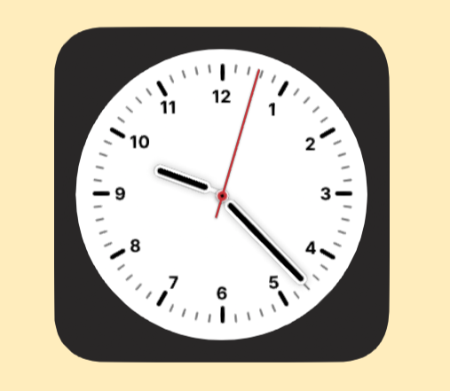

# Flutter组件实战
> 不做技术讲解，自己看源码。  
> "Talk is cheap, show me the code."   - Linus Torvalds
## 时钟组件
一个带动画的简单时钟组件  

 
### 使用到的组件
1. Container
2. Stack
3. Image
4. AnimationController
    - Curves.easeOutQuart

## 日历组件
编写中
## 进度组件
编写中
## 相册组件
编写中
## 相册组件
编写中
## 天气组件
编写中
## 天气组件
编写中
## 新闻组件
编写中
## 股市组件
编写中
## 股市组件
编写中